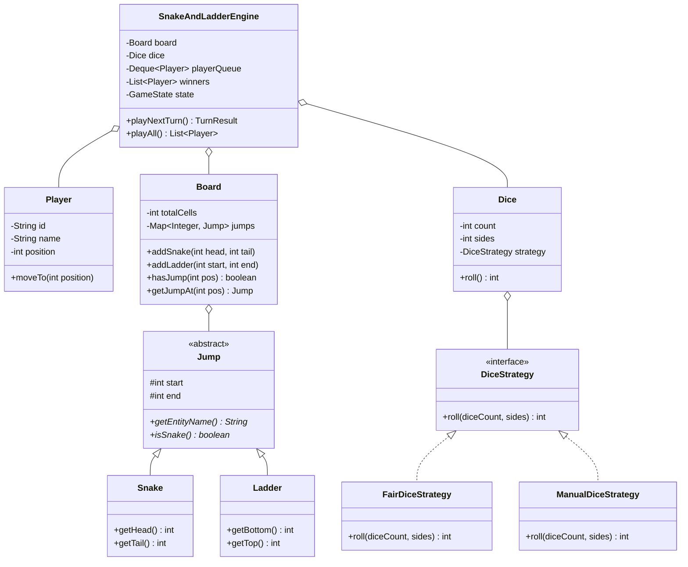

# Snake and Ladder — Low-Level Design (LLD)

A modular, extensible, and clean Low-Level Design for the classic **Snake and Ladder** game implemented in Java.

---

## 🏗 Architecture & Design Patterns

### 1. Design Patterns Used
- **Strategy Pattern (`DiceStrategy`)**: Encapsulates dice rolling logic. Easily swap between `FairDiceStrategy` (random gameplay) and `ManualDiceStrategy` (deterministic script for unit testing/replays).
- **Polymorphic Hierarchy (`Jump` $\to$ `Snake`, `Ladder`)**: Unified abstraction for all board jumping entities. Enforces domain invariants (`head > tail` for Snakes, `start < end` for Ladders).
- **State Pattern / Game Lifecycle (`GameState`)**: Controls game stages (`NOT_STARTED`, `IN_PROGRESS`, `GAME_OVER`).
- **Round-Robin Queue (`Deque<Player>`)**: Provides $O(1)$ turn rotations, immediate re-queueing for bonus rolls (e.g. rolling 6), and multi-winner rank tracking.

---

## 📊 Class Diagram



---

## 📁 Package Structure

```
snakeandladder/
├── model/
│   ├── GameState.java           # Game lifecycle enum
│   ├── Player.java              # Player entity tracking id, name, position
│   ├── Jump.java                # Abstract jumper
│   ├── Snake.java               # Snake (head > tail)
│   ├── Ladder.java              # Ladder (start < end)
│   └── Board.java               # Board grid, jump registry, cycle prevention
├── strategy/
│   ├── DiceStrategy.java        # Strategy interface for dice rolls
│   ├── FairDiceStrategy.java    # Random fair dice rolling
│   └── ManualDiceStrategy.java  # Scripted rolls for testing/replays
├── engine/
│   ├── Dice.java                # Dice model configuring count & sides
│   ├── TurnResult.java          # Encapsulates turn outcome & audit log
│   └── SnakeAndLadderEngine.java# Game orchestrator, overshoot rules, bonus rolls
└── SnakeAndLadderDemo.java      # End-to-end demo runner
```

---

## 🚀 How to Run

```bash
# Compile
javac -d out snakeandladder/model/*.java snakeandladder/strategy/*.java snakeandladder/engine/*.java snakeandladder/*.java

# Run Demo
java -cp out snakeandladder.SnakeAndLadderDemo
```
